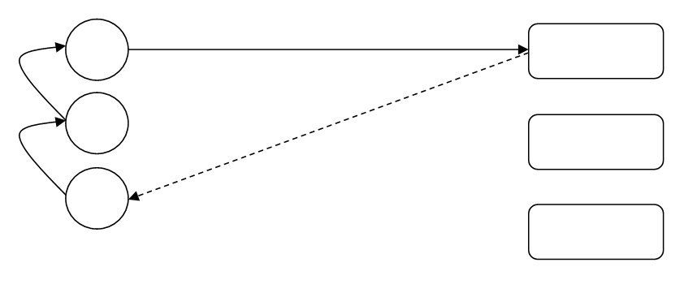
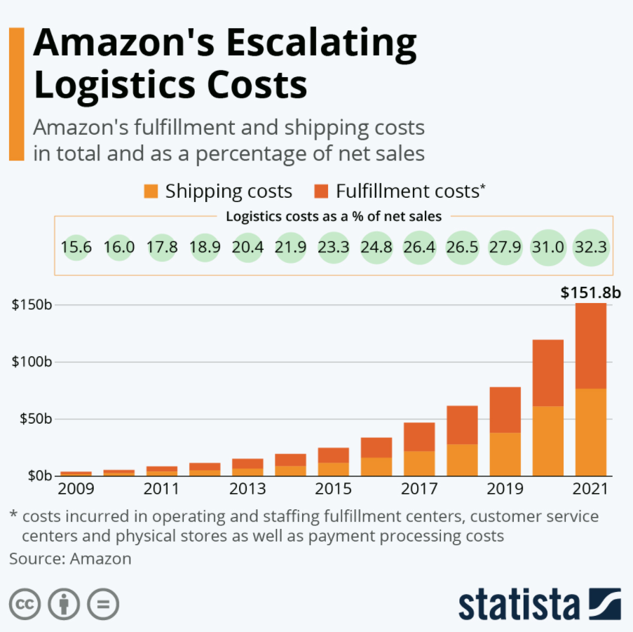

```{r child = "setup.Rmd"}
```

```{r xaringan-tile-view, echo=FALSE}
xaringanExtra::use_tile_view()
```

```{r xaringan-editable, echo=FALSE}
xaringanExtra::use_editable(expires = 1)
```

```{r xaringan-panelset, echo=FALSE, message=FALSE, warning=FALSE}
xaringanExtra::use_panelset()
xaringanExtra::style_panelset_tabs(panel_tab_font_family = "sans-serif")
```

```{r xaringanExtra-clipboard, echo=FALSE}
htmltools::tagList(
  xaringanExtra::use_clipboard(
    button_text = "<i class=\"fa fa-clipboard\"></i>",
    success_text = "<i class=\"fa fa-check\" style=\"color: #90BE6D\"></i>",
    error_text = "<i class=\"fa fa-times-circle\" style=\"color: #F94144\"></i>"
  ),
  rmarkdown::html_dependency_font_awesome()
)
```

```{r xaringan-fit-screen, echo=FALSE}
xaringanExtra::use_fit_screen()
```

```{r xaringan-extra-styles, echo=FALSE}
xaringanExtra::use_extra_styles(
  hover_code_line = TRUE,         #<<
  mute_unhighlighted_code = TRUE  #<<
)
```

```{r xaringan-scribble, echo=FALSE}
xaringanExtra::use_scribble()
```

class: center, middle

## Retrospecto

---

## Definições

### Logística

.midi[
.question[
“**Logística** é dispor a **mercadoria ou o serviço** certo, no **lugar** certo, no **tempo** certo e nas **condições desejadas**, ao mesmo tempo em que fornece a **maior contribuição à empresa**”. 
(Ballou, 2001)
]
]

### Gestão Cadeia de Suprimentos

.question[
.midi[
**Cadeia de suprimentos** é a estrutura consolidada e integrada, em níveis estratégico, tático e operacional, entre agentes de produção, mercadológicos, logísticos e sociedade, para que seja possível coordenar as operações de maneira a garantir a gestão orientada à logística, tendo como objetivo o _trade-off_ entre **responsividade** e **eficiência**, além de garantia de um contexto sustentável de desenvolvimento por ações **socialmente responsáveis** e **resilientes.** 
]
]

---

## Fatores-chave de desempenho

- **Instalações**   
- **Estoques**   
- **Transportes**   
- **Informação**   


---
### Gestão de Estoques
- Quanto pedir   
  - Custos de estoques   
  - Lote econômico de compras   

- Quando pedir   
  - Revisões contínuas e periódicas

- Como controlar o sistema   
  - Curva ABC   
  - Inventário   
  - Planejamento de estoques de segurança   
  
  
---
class: inverse, middle

# Redes Logísticas

---

## FATORES QUE INFLUENCIAM AS DECISÕES DE REDE

.pull-left[
### Sob a ótica do transportador
- Custo relacionado ao veículo
- Custo operacional fixo
- Custo relacionado à viagem
- Custo relacionado à quantidade
- Custo indireto
]

.pull-right[
### Sob a ótica do embarcador
- Custo de transporte
- Custo de estoque
- Custo de instalação
- Custo de processamento
- Custo do nível de serviço
]

.tip[
O projeto da rede logística é fator decisivo para garantir responsividade e eficiência na cadeia de suprimentos. 
]
---

# Tipos de redes logísticas

## Rede de entrega direta
.question[
Todas as entregas acontecem diretamente do fornecedor para o varejista. Neste caso, a rota de cada carregamento é pré-determinada, sendo necessário definir apenas o volume a ser transportado e o meio de transporte mais eficiente. 
]

---

# Tipos de redes logísticas

## Rede de entrega direta

.pull-left[
.midi[
**Vantagens:**
- eliminação de intermediários logísticos, como atacadistas ou centros de distribuição;   
- simplicidade de operação e coordenação;   
- decisão sobre embarque é local;   
- baixa interferência entre fluxos;   
- tempo de transporte do fornecedor até ao ponto de varejo é reduzido.   

]]

.pull-right[
.midi[
**Desvantagens:**
- no caso de lojas pequenas, a rede de entrega direta é onerosa;   
- geraria um elevado custo de estoque na cadeia de suprimentos;   
- os custos de recebimento são altos porque cada fornecedor deve fazer uma entrega separada.    
]]

.tip[
.midi[
São aconselháveis quando o tamanho das lojas varejistas for suficientemente grande para justificar lotes de suprimentos ótimos próximos à carga cheia proveniente de cada fornecedor. 
]]

---

# Tipos de redes logísticas

## Rede de entrega direta

```{r echo=FALSE, message=FALSE, warning=FALSE}
knitr::include_graphics("img/rede1.png")
```


---

# Tipos de redes logísticas

## Entrega direta com milk run (coletas programadas)

.question[
Milk Run é um tipo de transporte para entrega e coleta de produtos em que um caminhão pode tanto entregar ou coletar um produto partindo de um único fornecedor para diversos varejistas ou de diversos fornecedores para entregar para apenas um varejista, respectivamente.
]

**Vantagens:**
- Eliminação de depósitos intermediários
- Redução dos custos de transporte por consolida as entregas a diversas lojas em um único caminhão. 

---

# Tipos de redes logísticas

## Entrega direta com milk run (coletas programadas)

.pull-left[
```{r echo=FALSE, message=FALSE, warning=FALSE}
knitr::include_graphics("img/rede2.png")
```
]

.pull-right[
```{r echo=FALSE, message=FALSE, warning=FALSE}

```

]


---

# Tipos de redes logísticas

## Todas as entregas via centro de distribuição centralizado

.question[
A cadeia varejista distribui as lojas por localização geográfica e um CD é designado para atendimento destas lojas. Os fornecedores enviam as entregas para o CD e de lá as mercadorias são encaminhadas para as lojas. 
]

.midi[
- O CD pode desempenhar dois papéis diferentes, a saber: (i) **armazenar estoque**; (ii) **local de transferência**. 

- Os CDs auxiliam na redução dos custos da cadeia de suprimentos quando os fornecedores estão longe dos varejistas e os custos de transporte são altos, por meio de economias de escala. 

- O CD pode fazer apenas crossdocking, quando os lotes destinados às lojas servidas pelos CDs forem grandes o suficiente para atingir economias de escalas obtidas no ressuprimento de entrada. 
]

---

# Tipos de redes logísticas

## Todas as entregas via centro de distribuição centralizado

.question[
Crosdocking é o processo no qual chegam caminhões de diversos fornecedores, cuja carga é desmembrada em caminhões para diversos varejistas em carregamentos menores. 
]


```{r echo=FALSE, message=FALSE, warning=FALSE}
knitr::include_graphics("img/rede4.png")
```


---

# Tipos de redes logísticas


##	Entregas via centro de distribuição utilizando milk run

.question[
As entregas são realizadas a partir de um CD utilizando-se milk run quando os lotes a serem entregues em cada varejista forem pequenos, visando reduzir os custos com transportes por meio da consolidação. 
]


```{r echo=FALSE, message=FALSE, warning=FALSE}
knitr::include_graphics("img/rede5.png")
```


---

# Tipos de redes logísticas


##	Rede sob medida
.question[
O transporte mescla crosdocking, milk run, transportadoras truck load, less than truck load e carga expressa. 
]

---

## Vantagens e Desvantagens das diferentes redes de transporte

.small[
Estrutura de Rede	|Vantagens|	Desvantagens
----------------| ----------| -------------
Entrega direta|Não possui depósito intermediário <br/>	Fácil de coordenar	|Grandes estoques <br/>	Despesa significativa com recebimento
Entrega direta com milk runs|	Redução dos custos de transporte para lotes pequenos <br/>		Redução dos estoques	|	Coordenação mais complexa
Todas as entregas via CD com armazenagem|	Redução dos custos de entrada do transporte por meio de consolidação| Maior custo de estoque <br/>	Mais manuseio no CD
Todas entregas via CD com crossdocking|	Pouquíssima necessidade de estoques <br/>	Redução no custo de transporte devido à consolidação | Coordenação mais complexa
Entregas via CD com milk runs|	Redução no custo de saída do transporte para pequenos lotes	| Coordenação ainda mais complexa
Rede sob medida	| Escolha do transporte mais adequado às necessidades individuais do produto ou da loja	| Coordenação muitíssimo complexa
]

---

```{r echo=FALSE, message=FALSE, warning=FALSE, out.width="50%"}

```

---
# Revisão da distribuição de pontos

Pontos|	Entrega|	Atividade
------|--------|-----------
10| 17/11 | Estudos Autônomos 1 - Nivel de serviço logístico
10| 24/11 | Estudos Autônomos 2 - TICs e KPIs
15| 01/12 | Estudos Autônomos 3 – Logística Urbana
15| 24/01 | Estudos Autônomos 4 - Gestão de Transportes
15| 31/01 | Estudos Autônomos 5 - Gestão de estoques e armazenagem
15| 14/02 | Estudos Autônomos 6 - Multivarejo e omnichanel
20| 14/01	| Projeto incremental 1
TOTAL:| |	100 pontos

---

class: center, middle

.larger[
**DÚVIDAS?**
]
